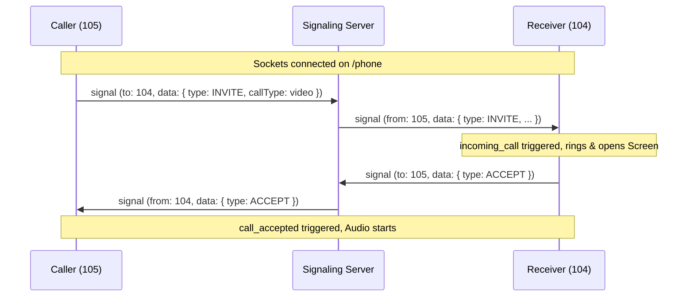

# 📞 Dolphin WebRTC Calling & Signaling System Guide

This guide explains the architecture, message routing, state machine, and API integration of the **HTTP-Phone WebRTC Calling System**. Use this document to understand the system and avoid breaking the calling structure during edits.

---

## 📂 1. Key Files Involved

| File / Module | Path | Purpose |
| --- | --- | --- |
| **Backend Entry & Upgrade** | [src/app.ts](file:///d:/http-phone/src/app.ts) | Upgrades HTTP connections to multiplexed WebSockets (`/realtime` and `/phone`). |
| **Realtime Gateway** | [src/realtime/realtime.ts](file:///d:/http-phone/src/realtime/realtime.ts) | Authenticates WebSocket tokens and routes connections to the signaling orchestrator. |
| **Signaling Orchestrator** | [webrtc-calling/index.ts](file:///d:/http-phone/node_modules/dolphin-server-modules/independent-modules/webrtc-calling/index.ts) | Routes SDP/ICE messages between extensions, tracks active peers (using `Set<WebSocket>` to prevent zombies), and handles `HEARTBEAT` pings. |
| **Frontend Entry & Listeners** | [app.jsx](file:///d:/http-phone/frontend/http-phone/app.jsx) | Handles login/session restore, initiates WebSockets (`initWebSocket`, `initSignaling`), runs call actions, and processes call states. |
| **Signaling Engine Client** | [DolphinRealtimeEngine.js](file:///d:/http-phone/frontend/http-phone/node_modules/dolphin-native/src/framework/DolphinRealtimeEngine.js) | Robust client-side WebSocket wrapper that handles auto-reconnects, incoming invite/accept parses, and maps signaling events. |
| **Call UI Screen** | [VideoCallScreen.jsx](file:///d:/http-phone/frontend/http-phone/pages/VideoCallScreen.jsx) | Renders UI states for `incoming`, `outgoing`, `connected`, and `idle` calls. Includes the `<WebRTCAudio>` rendering node. |

---

## 📡 2. Call Signaling Flow (WebSockets)

Signaling uses a dedicated WebSocket connection on `/phone?id=<userExt>&token=<token>`.

### A. Calling Protocol Messages
The client and server exchange signaling messages in JSON format with a `type`:
- **`signal`**: Transports SDP/ICE candidates to the peer.
- **`INVITE`**: Initiates a call request.
- **`ACCEPT`**: Approves the call.
- **`REJECT`**: Declines the call (busy/declined).
- **`HEARTBEAT`**: Keeps the connection alive (every 30s). Server replies with `HEARTBEAT_ACK`.

### B. Calling Sequence (Caller A -> Receiver B)

---

## 🔄 3. State Machine & Variables

Call states are driven by Dolphin Native framework states inside `app.jsx`.

### A. Core State Keys
- **`call_status`**: Current call state. Values: `'idle'`, `'incoming'`, `'outgoing'`, `'connected'`.
- **`call_partner_ext`**: Extension number of the peer (e.g. `'104'`).
- **`call_partner_name`**: Human-readable name of the peer (e.g. `'test app'`).
- **`call_direction`**: Direction of the call relative to this device. Values: `'inbound'`, `'outbound'`.
- **`call_log_id`**: Unique identifier tracking this specific call session in MongoDB.
- **`call_duration_str`**: MM:SS duration string. Updated by a 1-second interval when connected.

### B. Hardware (HW) Interface Integration
Call states command the phone hardware using `app.state('hw', '<command>')`:
- **`phone:incoming_call:<ext>`**: Notifies the native system of an incoming call.
- **`ringtone:play`**: Plays the incoming ringtone.
- **`ringtone:stop`**: Stops the ringtone/dial tone.
- **`webrtc:start`**: Initializes local audio devices and begins peer streaming.
- **`webrtc:stop`**: Tears down WebRTC channels and disables microphone/speakers.

---

## 🚫 4. Strict Safety Rules (CRITICAL FOR FUTURE DEVELOPERS & AIs)

> [!WARNING]
> Breaking these rules will stop signaling messages from reaching their destinations, cause infinite login/logout loops, or freeze the calling UI.

1. **Do NOT Modify the WebSocket URL Structure**:
   - `/phone` requires query parameters `id` (peer extension) and `token` (auth).
   - `/realtime` requires query parameters `token`, `deviceId`, and `platform`.
   - Never change these parameter keys.
2. **Never Remove Email / Password Trimming**:
   - Both backend controllers (`src/controllers/auth.ts`) and frontend actions (`app.jsx`) must call `.trim()` on emails to avoid space-related credential failures.
3. **Do NOT Restore Expired Sessions**:
   - `loadSession()` in `app.jsx` must verify token validity using `isTokenExpired(token)`. If expired, it must delete the session from `.dolphin-session.json` and redirect to `LoginScreen` instead of attempting socket reconnects.
4. **Preserve Zombie connection cleanup**:
   - `initSignaling` must iterate through `global.dolphinSignalingInstances` and disconnect/clear listeners of other devices matching the same extension before connecting the new WebSocket.
5. **Always send HEARTBEAT_ACK**:
   - The server must respond to `HEARTBEAT` signaling messages with `HEARTBEAT_ACK` to prevent the client from assuming the channel is dead.
