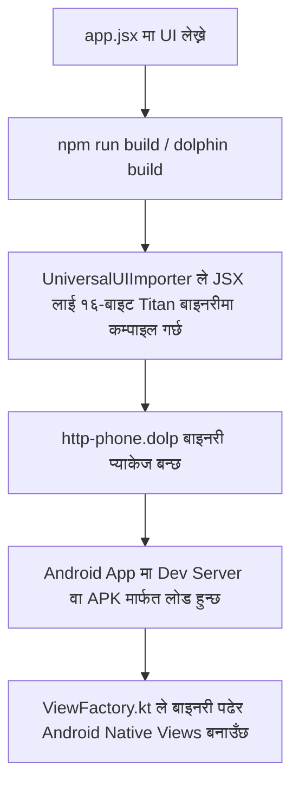

# 🐬 Dolphin & HTTP-Phone Integration: Flow & AI Debugging Guide

यो डकुमेन्ट **Dolphin Native**, **Dolphin Server (Modules)**, र **HTTP-Phone (Main Client/Backend)** बीचको कार्यप्रवाह (flow), महत्त्वपूर्ण फाइलहरूको स्थान, र सम्भावित बगहरू समाधान गर्नका लागि तयार गरिएको गाइड हो। यसले कुनै पनि AI वा विकासकर्तालाई प्रोजेक्टको संरचना तुरुन्तै बुझ्न मद्दत गर्दछ।

---

## 📂 १. प्रोजेक्टहरू र तिनीहरूको सम्बन्ध (Workspace Layout)

हाम्रो प्रणालीमा ३ वटा मुख्य फोल्डर/प्रोजेक्टहरू छन्:

### क. **HTTP-Phone** (मुख्य कार्यक्षेत्र - Main Workspace)
- **Path**: `d:\http-phone`
- **भूमिका**: यो हाम्रो मुख्य प्रोजेक्ट हो जसमा ब्याकइन्ड (Express-like Dolphin Server) र फ्रन्टइन्ड मोबाइल क्लाइन्ट (Dolphin Native App) दुवै समावेश छन्।
- **मुख्य फाइलहरू**:
  - `src/index.ts`: ब्याकइन्ड सुरु गर्ने मुख्य फाइल ([index.ts](file:///d:/http-phone/src/index.ts))।
  - `src/app.ts`: HTTP र WebSocket (multiplexing `/realtime` र `/phone`) सेटअप गर्ने ठाउँ ([app.ts](file:///d:/http-phone/src/app.ts))।
  - `src/controllers/`: `auth.ts`, `chat.ts`, र `directory.ts` नियन्त्रकहरू।
  - `frontend/http-phone/app.jsx`: मोबाइल एपको मुख्य एन्ट्री पोइन्ट ([app.jsx](file:///d:/http-phone/frontend/http-phone/app.jsx))।
  - `frontend/http-phone/pages/`: मोबाइल एपका स्क्रिनहरू (Home, Login, Register, Dashboard)।

### ख. **Dolphin-Server-Modules** (सर्भर मोड्युलहरू)
- **Path**: `C:\Users\USER\Desktop\dolphin-server`
- **भूमिका**: `http-phone` को ब्याकइन्डमा प्रयोग हुने कोर मोड्युलहरू (Auth, CRUD, WebSocket Server, Router) यहाँ छन्। यो `package.json` मा `"dolphin-server-modules": "file:C:/Users/USER/Desktop/dolphin-server"` को रूपमा जोडिएको छ।
- **मुख्य फाइलहरू**:
  - `src/auth/auth.ts`: २FA/TOTP, JWT, र रिफ्रेस टोकन व्यवस्थापन गर्ने मुख्य तर्क ([auth.ts](file:///C:/Users/USER/Desktop/dolphin-server/src/auth/auth.ts))।
  - `src/router/router.ts`: सर्भरको रूटिङ प्रणाली।
  - `src/server/server.ts`: कोर Koa/Express-like सर्भर र्यापर।

### ग. **Dolphin-Native** (मोबाइल रनटाइम र कम्पाइलर)
- **Path**: `D:\dolphin-native`
- **भूमिका**: यसले फ्रन्टइन्डको JSX/HTML लाई १६-बाइटको **Titan Binary Protocol** मा कम्पाइल गर्छ र एन्ड्रोइड नेटिभ भ्युजमा रेन्डर गर्छ। फ्रन्टइन्डको `package.json` मा यो `"dolphin-native"` को रूपमा निर्भर (dependency) छ।
- **मुख्य फाइलहरू**:
  - `src/ui/UniversalUIImporter.js`: JSX लाई १६-बाइटको बाइनरी प्याकेटमा ढाल्ने कोड ([UniversalUIImporter.js](file:///D:/dolphin-native/src/ui/UniversalUIImporter.js))।
  - `runtime/android/`: एन्ड्रोइड नेटिभ रनटाइम (Kotlin)।
    - `ViewFactory.kt`: नेटिभ कम्पोनेन्टहरू म्याप र सिर्जना गर्ने डिस्पाचर।
    - `ViewFactoryLayouts.kt`: Layout containers (Column, Row, GridView, आदि)।

---

## 🔄 २. मुख्य कार्यप्रवाह (Flow of Operation)

### क. मोबाइल एप कम्पाइल र रन फ्लो


### ख. ब्याकइन्ड र अथेन्टिकेशन (Authentication) फ्लो
1. **साइनअप/लगइन**: क्लाइन्टले `/api/auth/register` वा `/api/auth/login` मा अनुरोध पठाउँछ।
2. **२FA (दुई-चरण प्रमाणीकरण)**: यदि २FA सक्षम छ भने, OTP कोड प्रमाणित गर्नुपर्छ।
3. **टोकन र कुकी**: सर्भरले छोटो अवधिको `accessToken` (JWT) फर्काउँछ र लामो अवधिको `refreshToken` कुकी (`rt`) मा सेट गर्छ।
4. **लगआउट**: `/api/auth/logout` कल गर्दा सर्भरको डेटाबेस र मेमोरीबाट `refreshToken` हट्छ।

### ग. रियलटाइम च्याट र WebRTC कलिङ फ्लो
- **Multiplexed WebSockets**:
  - `/realtime?token=JWT`: उपस्थिति (Presence), च्याट, र समूह सन्देशहरूको लागि।
  - `/phone?token=JWT`: WebRTC कलहरूको लागि सिग्नलिङ सर्भर (Signaling Server) को रूपमा काम गर्छ।

---

## 🛠️ ३. डिबगिङ र समाधान गरिएका त्रुटिहरू (Debugging Log)

यो प्रोजेक्ट सेटअप र डिबग गर्दा पत्ता लागेका र समाधान गरिएका मुख्य समस्याहरू:

### १. `authService.logout` आर्गुमेन्ट त्रुटि (Resolved)
- **समस्या**: `http-phone` को `src/controllers/auth.ts` मा `authService.logout(dbAdapter, token, ctx.res)` कल गर्दा TypeScript ले त्रुटि देखाएको थियो।
- **कारण**: `dolphin-server-modules` को नयाँ संस्करणको `logout` फङ्क्सनले केवल २ वटा आर्गुमेन्ट (`db` र `refreshToken`) मात्र लिन्छ, तेस्रो `res` आवश्यक पर्दैन।
- **समाधान**: यसलाई `authService.logout(dbAdapter, token)` मा परिवर्तन गरियो।

### २. `UniversalUIImporter` टेस्ट केस विफलता (Resolved)
- **समस्या**: `dolphin-native` को `test/test.js` रन गर्दा `Successfully Generated: 0` र `Failed: 1000` देखाएको थियो।
- **कारण**: `importSchema` ले सिधै बाइनरी बफर नफर्काई `{ binaries: Buffer[], stringData: Buffer }` अब्जेक्ट फर्काउँछ। टेस्ट फाइलमा `binary.length === 16` चेक गरिएको हुनाले यो सधैँ `undefined` भएर असफल हुन्थ्यो।
- **समाधान**: यसलाई `const binary = result && result.binaries && result.binaries[0]` बाट बफर निकालेर प्रमाणित गर्ने बनाइयो। अब १०००/१००० टेस्ट केसहरू सफल हुन्छन्।

---

## 🚀 ४. उपयोगी कमान्डहरू (Useful Developer Commands)

### HTTP-Phone (Backend & Dev Server)
```bash
# http-phone ब्याकइन्ड रन गर्न
cd d:\http-phone
npm run dev

# टाइपस्क्रिप्ट कम्पाइलेसन चेक गर्न
npx tsc --noEmit
```

### Dolphin-Native (Compiler & Tests)
```bash
# Titan बाइनरी कम्पाइलरका टेस्टहरू चलाउन
cd D:\dolphin-native
node test/test.js
node test/test.protocol.js
```

### Dolphin-Server (Core Modules Tests)
```bash
# सर्भर युनिट टेस्टहरू चलाउन (३७३+ टेस्ट केसहरू)
cd C:\Users\USER\Desktop\dolphin-server
npm test
```

---

## 💡 ५. डिबगिङ चेकलिस्ट (AI Troubleshooting Checklist)
1. **यदि हटप्याच (Hot-patch) चल्दैन भने**:
   - `adb reverse tcp:9091 tcp:9091` कमान्ड चलाएर TCP पोर्ट फर्काइएको निश्चित गर्नुहोस्।
   - मोबाइल र कम्प्युटर एउटै वाइफाइ नेटवर्कमा जोडिएको र सही सर्भर IP हालिएको सुनिश्चित गर्नुहोस्।
2. **यदि डेटाबेस समस्या आएमा**:
   - स्थानीय MongoDB सर्भर चलिरहेको छ कि छैन जाँच्नुहोस् (`localhost:27017`)।
3. **यदि बिल्ड बिग्रिएमा**:
   - `d:\http-phone\frontend\http-phone` मा गएर `npm run build` चलाउनुहोस् र कम्पाइलर लगहरू जाँच गर्नुहोस्।

---

## 📢 ६. महत्त्वपूर्ण निर्देशिका (Framework Development & Testing Focus)
> [!IMPORTANT]
> - **We are not building the http-phone product itself**: हामी यहाँ `http-phone` प्रोडक्ट बनाउँदै छैनौँ, बरु केवल `dolphin-native` र `dolphin-server-modules` फ्रेमवर्कहरू विकास र चेक गर्दैछौँ।
> - **Framework Testing & Builds**: `dolphin-native` र `dolphin-server-modules` मा कुनै पनि काम/परिवर्तन गरेपछि, सबै टेस्टिङ बिल्ड (testing builds) र युनिट टेस्टहरू पूर्ण रूपमा चेक र प्रमाणित गर्नुपर्छ ताकि फ्रेमवर्कहरू त्रुटिरहित र बलियो बनून्।

### ३. WebRTC Signaling Loop & Zombie Connection Fix (Resolved)
- **समस्या**: WebRTC कलिङ गर्दा ४५ सेकेन्डमा डिरेक्ट कनेक्सन विच्छेद भएर लुप चल्ने र "calling" स्टक हुने। साथै एउटै प्रयोगकर्ताले बारम्बार कनेक्सन गर्दा पुराना (Zombie) कनेक्सनले नयाँ कललाई ओभरराइड गर्थे।
- **कारण**: क्लाइन्ट (`DolphinRealtimeEngine`) ले हार्टबिट पठाउँथ्यो तर सर्भर मोड्युल (`webrtc-calling`) ले `HEARTBEAT_ACK` नफर्काउँदा क्लाइन्टले कनेक्सन मरेको मानेर विच्छेद गर्थ्यो।
- **समाधान**: सर्भरको `webrtc-calling/index.ts` मा `HEARTBEAT` प्रोसेसिङ थपियो। `app.jsx` मा `initSignaling` भित्र पुरानो कनेक्सन पूर्ण रूपमा विच्छेद (disconnect र listeners clear) गर्ने र `getLocalIP()` लाई `127.0.0.1` मा बाध्यकारी बनाइयो।

### ४. Audio Choppy/Cutting Fix (Resolved — 2026-06-25)
- **समस्या**: Call गर्दा audio थोरै मात्र आउने, कटिने (choppy/cutting)। Call accept गरेपछि पहिलो केही सेकेन्डको audio बिल्कुलै सुनिँदैनथ्यो।
- **कारणहरू (४ वटा)**:
  1. **Self-subscription bug**: `setupSignalingListeners` ले `audio_stream/आफ्नो_ext` subscribe गर्थ्यो, तर आफ्नो audio stream मा आफ्नै voice आउँदैन — partner को stream subscribe गर्नुपर्थ्यो।
  2. **Duplicate subscription**: `setupSignalingListeners` हरेक hot-reload मा `app.realtime.subscribers.clear()` गरेर फेरि subscribe गर्थ्यो। यसले race condition र duplicate handlers बनाउँथ्यो।
  3. **Race condition**: `webrtc:start` hardware command पठाउनु अगाडि partner को audio stream subscribe नगरिँदा पहिलो packet हराउँथ्यो।
  4. **Hot audio path logging**: `hw_result:webrtc_mic_data` handler मा प्रत्येक mic packet मा `console.log` call हुँदा CPU time waste भई latency/jitter थपिन्थ्यो।
- **समाधान** (`app.jsx`):
  - `subscribeToPartnerAudio(activeDeviceId, partnerExt)` helper function थपियो जसले duplicate subscribe रोक्छ (`audioSubscribedExt` flag बाट)।
  - Audio subscribe `setupSignalingListeners` बाट हटाइयो — `call_accepted` र `app:accept_call` events मा `webrtc:start` अघि नै गरिने भयो।
  - `cleanupCallSession` मा audio subscription cleanup थपियो ताकि अर्को call मा fresh subscribe होस्।
  - `hw_result:webrtc_mic_data` handler को सबै `console.log` हटाइयो र string split logic optimize गरियो।
  - `app:accept_call` action ले अब `(action, val, deviceId)` parameters लिन्छ।

### ६. Audio Routing Wrong WebSocket Bug Fix (Resolved — 2026-06-29)
- **समस्या**: Audio call connect हुँदा पनि अर्को device मा audio सुनिँदैनथ्यो। `subscribeToPartnerAudio` र `hw_result:webrtc_mic_data` दुवैले `app.realtime.publish/subscribe` use गर्थे — जो `/phone` signaling endpoint मा जान्छ। तर server को `/phone` handler (`signalingOrchestrator`) ले `audio_stream/*` pub/sub handle गर्दैन, केवल INVITE/ACCEPT/REJECT/SDP/ICE मात्र handle गर्छ। तसर्थ सम्पूर्ण audio data हराउँथ्यो।
- **कारण (३ वटा)**:
  1. **Wrong WebSocket channel**: `app.realtime.publish/subscribe` → `/phone` → `signalingOrchestrator` → audio topics ignore हुन्थे।
  2. **Server-side pub handler missing**: `/realtime` server handler मा client-originated `pub` type messages को कुनै handling थिएन।
  3. **Cleanup bug**: `cleanupCallSession` ले `app.realtime.unsubscribe` call गर्थ्यो जुन `/phone` मा जान्थ्यो — actual subscription unsubscribe हुँदैनथ्यो।
- **समाधान**:
  - `subscribeToPartnerAudio`: `app.realtime.subscribe` को सट्टा `wsInst.wsClient.send({ type: 'sub', topic: 'audio_stream/ext' })` — `/realtime` WebSocket बाट subscribe।
  - `hw_result:webrtc_mic_data`: `app.realtime.publish` को सट्टा `wsInst.wsClient.send({ type: 'pub', topic: 'audio_stream/ext', payload: {...} })` — `/realtime` बाट publish।
  - `cleanupCallSession`: `app.realtime.unsubscribe` को सट्टा `wsInst.wsClient.send({ type: 'unsub', topic: '...' })`।
  - `initWebSocket` message handler मा `audio_stream/` topic handler थपियो।
  - `realtime.ts` मा `payload.type === 'pub'` को handling थपियो — `rt.publish(payload.topic, payload.payload)` call गर्ने।

### ८. Intercom Audio Protocol Mismatch Fix (Resolved — 2026-06-29)
- **समस्या**: Call connect भएपछि दुवै device मा audio बिल्कुलै सुनिँदैनथ्यो (complete silence)। यो `DolphinIntercom.kt` र `intercom.ts` server बीचको protocol mismatch थियो।
- **कारणहरू (२ वटा)**:
  1. **Push side broken**: `DolphinIntercom.kt` ले raw PCM bytes (`Content-Type: application/octet-stream`) POST गर्थ्यो। तर `intercom.ts` ले `ctx.body.audio` (base64 JSON field) expect गर्थ्यो। Dolphin framework ले octet-stream body JSON parse गर्दैन, त्यसैले `audioB64` सधैँ `''` हुन्थ्यो → **server queue मा एकपनि audio frame store हुँदैनथ्यो**।
  2. **Pull side broken**: Server ले `JSON.stringify({ audio: base64String, rate: 8000 })` response पठाउँथ्यो। `DolphinIntercom.kt` ले ती bytes सिधै `audioTrack.write()` मा pass गर्थ्यो → **JSON text as PCM = garbage noise वा silence**। साथै, `frames.map(f => f.audio).join('')` गरेर multiple base64 strings concatenate गर्दा corrupted audio हुन्थ्यो (base64 padding बीचमा हुन्छ)।
- **समाधान** (`intercom.ts` मात्र — Kotlin code correct थियो):
  - `AudioFrame` type → `Buffer[]` queue मा परिवर्तन।
  - `pushAudio`: `getRawBody()` helper थपियो जसले (१) Buffer, (२) base64 JSON (legacy), (३) raw req stream — तीनवटै cases handle गर्छ।
  - `pullAudio`: Raw PCM bytes `application/octet-stream` मा return गर्छ। Maximum ५ frames drain गरेर stale audio buildup रोक्छ।
  - Hot-reload survive गर्न global cache key `__intercomAudioQueues` → `__intercomRawQueues` मा change।

### ९. Speaker Toggle Handler Missing Fix (Resolved — 2026-06-29)
- **समस्या**: Call screen मा Speaker button थिचेपछि केही हुँदैनथ्यो। Speaker toggle silently fail हुन्थ्यो।
- **कारण**: `app:toggle_speaker` action ले `app.state('hw', 'audio:speaker:on')` / `audio:speaker:off` पठाउँथ्यो, तर `DolphinHardwareBridge.kt` को `"audio"` section मा `"speaker"` sub-case नै थिएन।
- **समाधान**: `DolphinHardwareBridge.kt` को `audio` when-block मा `"speaker"` case थपियो → `audioManager.isSpeakerphoneOn = turnOn`।

### ७. Incoming Call Partner Name Fix (Resolved — 2026-06-29)
- **समस्या**: Incoming call आउँदा receiver को screen मा caller को नाम "Extension 104" जस्तो देखिन्थ्यो — वास्तविक नाम देखिँदैनथ्यो।
- **कारण**: `setupSignalingListeners` को `incoming_call` handler ले directory lookup नगरी सिधै `Extension ${from}` set गर्थ्यो।
- **समाधान**: `incoming_call` handler मा `directory_users` state बाट extension match गरी real name lookup गरिने भयो।

### ५. Call Audio Silent + Volume Buttons Not Working Fix (Resolved — 2026-06-26)
- **समस्या**: Call connect भए पनि audio सुनिँदैनथ्यो। Mobile को volume button ले call volume control गर्दैनथ्यो (media volume मात्र बदलिन्थ्यो)।
- **कारणहरू (३ वटा)**:
  1. **Wrong audio stream type**: `DolphinHardwareBridge.kt` ले `AudioManager.MODE_NORMAL` र `STREAM_MUSIC` प्रयोग गर्थ्यो — VoIP call को लागि `MODE_IN_COMMUNICATION` + `USAGE_VOICE_COMMUNICATION` चाहिन्छ।
  2. **Main-thread audio bottleneck**: Partner को audio packet हरेक 40ms मा `app.state('hw', ...)` → `PATCH_STATE` → main thread → log (full base64!) बाट जान्थ्यो। यसले audio queue overflow र silence निम्त्याउँथ्यो।
  3. **No volumeControlStream**: Activity मा `volumeControlStream = STREAM_VOICE_CALL` सेट नगरिएकोले hardware volume keys ले call volume नचलाउने।
- **समाधान**:
  - `DolphinHardwareBridge.kt`: VoIP audio routing (`MODE_IN_COMMUNICATION`, `AudioAttributes.USAGE_VOICE_COMMUNICATION`, `STREAM_VOICE_CALL`), audio focus, speaker toggle (`hw:webrtc:speaker:on/off`)।
  - `DolphinRuntime.kt` + `HotPatchClient.kt`: `hw:audio:stream_play` packets को fast path — main thread bypass, verbose logging हटाइयो।
  - `VideoCallScreen.jsx` + `app.jsx`: Speaker/Earpiece toggle button थपियो।
